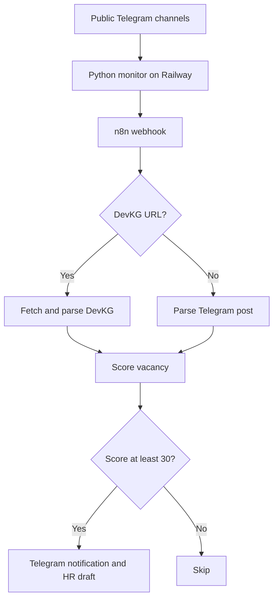

# Job Search Automation

Automation system that monitors public Telegram job channels, sends new posts to n8n, evaluates vacancy relevance, and delivers suitable opportunities to a personal Telegram bot.

## Current status

The n8n workflow in this repository is the processing layer of a larger system. In the working deployment, a Python service hosted on Railway checks four public Telegram channels every 90 seconds and sends new posts to this webhook.

The public Python monitor will be added separately after its source file is recovered and sanitized.

## What the n8n workflow does

1. accepts a normalized public-channel post through a webhook;
2. detects whether the post contains a DevKG vacancy URL;
3. fetches and parses the DevKG page when a URL is present;
4. otherwise parses the Telegram post directly;
5. extracts the title, company, salary, work format and HR username when available;
6. scores the vacancy against Daniel's confirmed skills;
7. filters out results below 30 points;
8. creates a draft message for HR;
9. sends the scored vacancy to a personal Telegram bot.

## Architecture

## Monitored channels in the working deployment

- `@remote` — Remote / Projects / Relocate | DevKG
- `@codifynews` — Jobs | Codify
- `@findwork` — Jobs | DevKG
- `@backend_frontend_jobs` — Frontend / Backend / Mobile

## Scoring logic

The workflow starts from a base score and adds points for relevant technologies and roles:

- Python, backend and REST API;
- frontend, HTML, CSS and JavaScript;
- AI and automation;
- project or product coordination;
- SQL and databases;
- junior or internship suitability;
- Git, Figma and Docker.

It subtracts points for senior/lead requirements, long mandatory experience, narrow Telecom/VoIP specialization and unrelated DevOps-heavy roles.

Results:

- **70–100:** priority application;
- **30–69:** regular application with caution;
- **below 30:** skip.

The rules are heuristic and should support human judgment, not replace it.

## Stack

- n8n
- JavaScript Code nodes
- Python monitoring service
- Railway
- Telegram public pages
- Telegram Bot API
- HTTP and webhooks
- HTML parsing and rule-based scoring

## Import and setup

1. Download `workflows/devkg-job-assistant-v2.json`.
2. Import the file into n8n.
3. Connect your own Telegram Bot credentials.
4. Replace `YOUR_TELEGRAM_CHAT_ID` with the destination chat ID.
5. Publish the webhook and copy its production URL.
6. Configure the monitor to send POST requests containing:
   - `message_text`;
   - `source_url`;
   - `channel_username`;
   - `message_id`;
   - `message_date`.
7. Store the production webhook URL as a secret environment variable. Never commit it.
8. Test both branches: a DevKG link and a direct Telegram vacancy.

## Security

The public workflow contains no real Telegram chat ID, bot token, credentials or production webhook URL. Do not commit:

- bot tokens;
- n8n credentials;
- production webhook URLs;
- Railway environment variables;
- Telegram login codes;
- personal data not required by the project.

## Current limitations

- The Python/Railway monitor source is not yet included in this repository.
- There is no persistent vacancy log.
- Duplicate protection is not yet implemented in the public workflow.
- The system does not contact HR automatically.
- The system does not attach or send a résumé.
- Scoring quality has not yet been validated on a large dataset.
- DevKG page parsing may need updates if the website markup changes.

## Planned improvements

- add the sanitized Python monitor;
- add deduplication and a vacancy database;
- add buttons: **Send to HR**, **Edit**, **Skip**;
- attach the current résumé only after explicit confirmation;
- add follow-up reminders after 5–7 business days;
- add error notifications and execution metrics.

## Repository contents

- [n8n workflow](workflows/devkg-job-assistant-v2.json)
- [Architecture documentation](docs/architecture.md)
- [Example webhook request](examples/webhook-input.json)
- [Example scored vacancy](examples/scored-vacancy-output.json)
- [Safe configuration template](.env.example)

## Author

**Lee Daniel** — AI Automation / Full Stack Developer  
Bishkek, Kyrgyzstan
