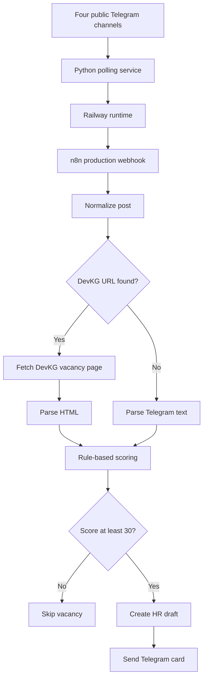

# Architecture

## Purpose

The system reduces manual job searching by monitoring selected public Telegram channels, normalizing new posts, evaluating relevance and sending suitable vacancies to a private Telegram bot.

## End-to-end data flow

## Request contract

The monitor sends a JSON POST request to n8n:

- `message_text` — original Telegram post;
- `source_url` — public link to the post;
- `channel_username` — source channel without private account data;
- `message_id` — source message identifier;
- `message_date` — source publication date.

## Processing branches

### DevKG vacancy

When the text contains a `devkg.com` URL, n8n fetches the public page and extracts its visible content. The parser attempts to identify title, company, work type, salary, description and an HR Telegram username.

### Direct Telegram vacancy

When no DevKG URL exists, the workflow parses the Telegram text directly and uses the first meaningful line as the vacancy title.

## Scoring

The score starts from a base value and changes according to matches:

- Python, backend and API;
- frontend and JavaScript;
- AI and automation;
- project or product coordination;
- databases;
- junior or internship suitability;
- supporting tools such as Git, Figma and Docker.

Penalties apply to senior/lead roles, long mandatory experience, narrow Telecom/VoIP requirements and unrelated DevOps-heavy positions.

## Delivery

Vacancies scoring at least 30 points are sent to the configured Telegram chat with extracted details, scoring reasons, source links and a draft message for HR.

## Trust boundaries

- Public Telegram posts and fetched HTML are untrusted input.
- The webhook URL is a secret environment value.
- Telegram credentials remain inside n8n.
- The system creates drafts only; it does not contact HR automatically.
- A résumé must not be sent without explicit user confirmation.

## Missing component

The current public repository includes the n8n processing workflow. The Python/Railway monitor will be documented and added after its source file is recovered and sanitized.
